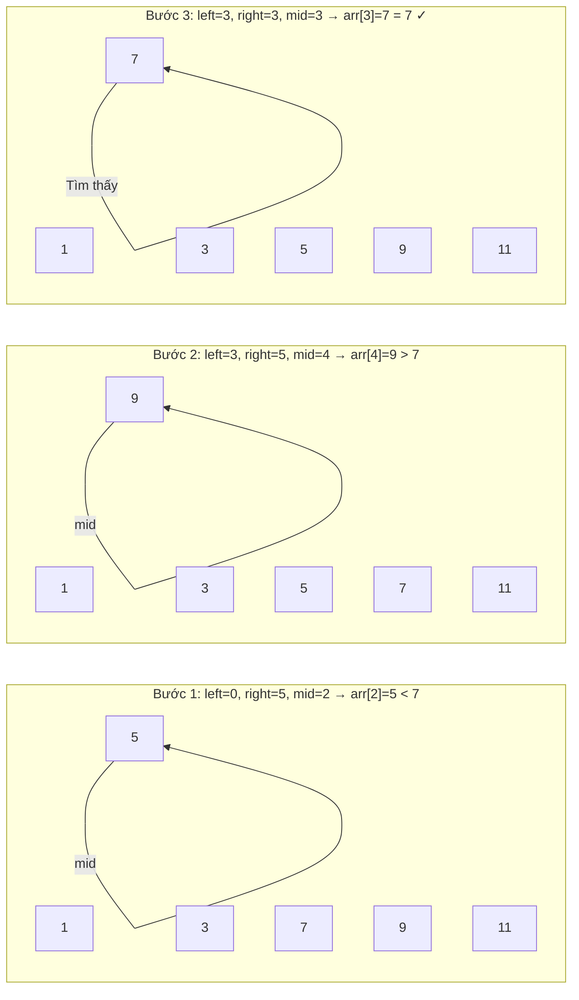

# 1. Tìm kiếm nhị phân (Binary Search)

## 1.1. Tổng quan

**Tìm kiếm nhị phân** là thuật toán tìm vị trí của một phần tử trong một **mảng đã được sắp xếp** bằng cách liên tục chia đôi khoảng tìm kiếm.

**Ứng dụng thực tế:** Tìm tên trong danh bạ đã sắp theo ABC; tìm giá trong danh sách giá đã sort; game "đoán số trong khoảng 1–100" với gợi ý lớn hơn/nhỏ hơn; tìm kiếm trong index đã sắp.

| Thuộc tính | Giá trị |
|------------|--------|
| **Độ phức tạp thời gian** | O(log n) |
| **Độ phức tạp không gian** | O(1) (lặp) / O(log n) (đệ quy) |
| **Điều kiện** | Mảng phải được sắp xếp |
| **Loại** | Chia để trị / Tìm kiếm |

---

## 1.2. Ý tưởng

1. So sánh phần tử cần tìm `x` với phần tử ở **giữa** mảng `mid`.
2. Nếu `x == arr[mid]` → tìm thấy, trả về `mid`.
3. Nếu `x < arr[mid]` → tìm trong **nửa trái** (chỉ số thấp hơn).
4. Nếu `x > arr[mid]` → tìm trong **nửa phải** (chỉ số cao hơn).
5. Lặp hoặc đệ quy cho đến khi tìm thấy hoặc khoảng rỗng.

### Hình minh họa: Chia đôi khoảng tìm kiếm

Tìm `x = 7` trong mảng `[1, 3, 5, 7, 9, 11]`. Mũi tên chỉ khoảng đang xét; `mid` là phần tử so sánh.



**Sơ đồ thuật toán (flowchart):**

```mermaid
flowchart TD
    Start([Bắt đầu]) --> Check{left ≤ right?}
    Check -->|Không| NotFound([Không tìm thấy])
    Check -->|Có| Mid[mid = left + right / 2]
    Mid --> Compare{arr[mid] == x?}
    Compare -->|Có| Found([Trả về mid])
    Compare -->|Không| Less{arr[mid] < x?}
    Less -->|Có| Right[left = mid + 1]
    Less -->|Không| Left[right = mid - 1]
    Right --> Check
    Left --> Check
```

---

## 1.3. Mã giả (Pseudocode)

```
BINARY_SEARCH(arr, left, right, x):
    while left <= right:
        mid = left + (right - left) / 2
        if arr[mid] == x:
            return mid
        if arr[mid] < x:
            left = mid + 1
        else:
            right = mid - 1
    return -1   // không tìm thấy
```

---

## 1.4. Ví dụ minh họa

Tìm `x = 7` trong mảng `[1, 3, 5, 7, 9, 11]`.

| Bước | left | right | mid | arr[mid] | So sánh | Hành động |
|------|------|-------|-----|----------|---------|-----------|
| 1 | 0 | 5 | 2 | 5 | 7 > 5 | left = 3 |
| 2 | 3 | 5 | 4 | 9 | 7 < 9 | right = 3 |
| 3 | 3 | 3 | 3 | 7 | 7 == 7 | **Tìm thấy tại index 3** |

---

## 1.5. Code mẫu

### Python (vòng lặp)

```python
def binary_search(arr, x):
    left, right = 0, len(arr) - 1
    while left <= right:
        mid = left + (right - left) // 2
        if arr[mid] == x:
            return mid
        if arr[mid] < x:
            left = mid + 1
        else:
            right = mid - 1
    return -1

# Ví dụ
arr = [1, 3, 5, 7, 9, 11]
print(binary_search(arr, 7))   # 3
print(binary_search(arr, 6))   # -1
```

### Python (đệ quy)

```python
def binary_search_recursive(arr, x, left=0, right=None):
    if right is None:
        right = len(arr) - 1
    if left > right:
        return -1
    mid = left + (right - left) // 2
    if arr[mid] == x:
        return mid
    if arr[mid] < x:
        return binary_search_recursive(arr, x, mid + 1, right)
    return binary_search_recursive(arr, x, left, mid - 1)
```

### C++

```cpp
#include <vector>
using namespace std;

int binarySearch(const vector<int>& arr, int x) {
    int left = 0, right = (int)arr.size() - 1;
    while (left <= right) {
        int mid = left + (right - left) / 2;
        if (arr[mid] == x) return mid;
        if (arr[mid] < x) left = mid + 1;
        else right = mid - 1;
    }
    return -1;
}
```

---

## 1.6. Phân tích độ phức tạp

- **Thời gian**: Mỗi bước giảm khoảng tìm kiếm còn một nửa → tối đa log₂(n) bước → **O(log n)**.
- **Không gian**: Chỉ dùng vài biến (lặp) → **O(1)**; nếu đệ quy thì stack gọi → **O(log n)**.

---

## 1.7. Biến thể thường gặp

- **Lower bound**: Tìm vị trí nhỏ nhất sao cho `arr[i] >= x`.
- **Upper bound**: Tìm vị trí nhỏ nhất sao cho `arr[i] > x`.
- **Tìm kiếm nhị phân trên đáp án**: dùng khi bài toán có tính đơn điệu (ví dụ: tìm giá trị nhỏ nhất thỏa mãn điều kiện).

---

## 1.8. Tài liệu tham khảo

- [Binary search - Wikipedia](https://en.wikipedia.org/wiki/Binary_search_algorithm)
- Sách: *Introduction to Algorithms* (CLRS)
