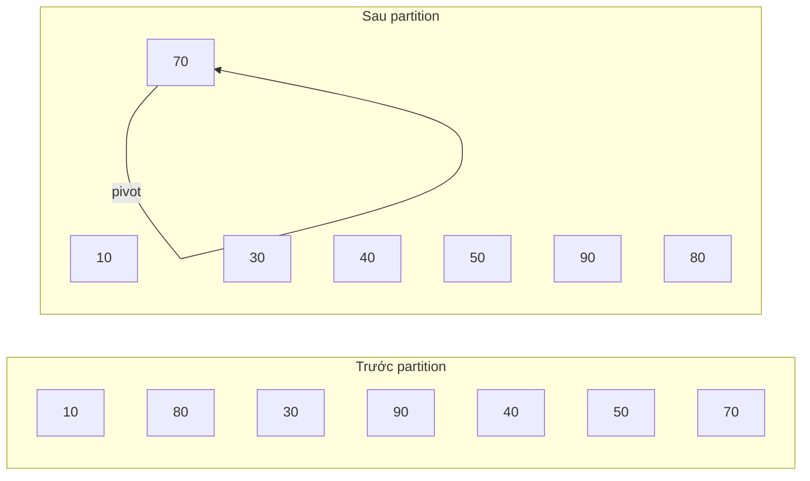
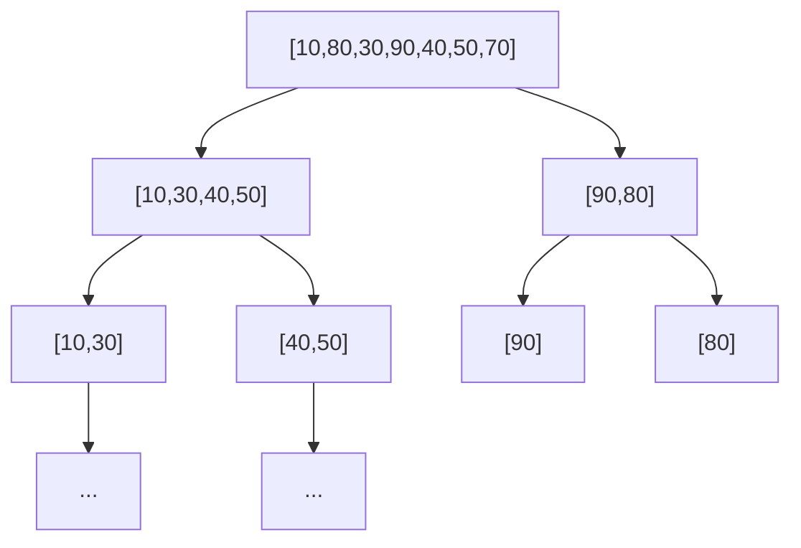

# 2. Quick Sort (Sắp xếp nhanh)

## 2.1. Tổng quan

**Quick Sort** là thuật toán sắp xếp dựa trên **chia để trị**: chọn một phần tử làm **pivot**, phân hoạch mảng thành hai phần (nhỏ hơn pivot và lớn hơn pivot), sau đó sắp xếp đệ quy từng phần.

**Ứng dụng thực tế:** Sắp xếp danh sách sản phẩm theo giá, ngày, tên; chuẩn bị dữ liệu trước khi dùng tìm kiếm nhị phân hoặc merge; sort trong thư viện (ví dụ Java, C++).

| Thuộc tính | Giá trị |
|------------|--------|
| **Độ phức tạp thời gian (TB)** | O(n log n) |
| **Độ phức tạp thời gian (xấu nhất)** | O(n²) |
| **Độ phức tạp không gian** | O(log n) (stack đệ quy) |
| **Ổn định** | Không |
| **Sắp xếp tại chỗ** | Có |

---

## 2.2. Ý tưởng

1. **Chọn pivot**: Thường chọn phần tử cuối (hoặc đầu, giữa, random).
2. **Phân hoạch (partition)**: Đưa tất cả phần tử nhỏ hơn pivot sang trái, lớn hơn sang phải; đặt pivot vào đúng vị trí.
3. **Đệ quy**: Sắp xếp đoạn trái pivot và đoạn phải pivot.

### Hình minh họa: Partition và cây đệ quy

**Bước partition** — pivot = 70. Mũi tên: các phần tử ≤ pivot dồn sang trái.



**Cây đệ quy Quick Sort** — mỗi nút là một lần gọi với đoạn [low, high]; lá là đoạn 1 phần tử (đã sắp).



---

## 2.3. Mã giả (Pseudocode)

```
QUICK_SORT(arr, low, high):
    if low < high:
        pivot_index = PARTITION(arr, low, high)
        QUICK_SORT(arr, low, pivot_index - 1)
        QUICK_SORT(arr, pivot_index + 1, high)

PARTITION(arr, low, high):
    pivot = arr[high]
    i = low - 1
    for j = low to high - 1:
        if arr[j] <= pivot:
            i = i + 1
            swap arr[i] và arr[j]
    swap arr[i + 1] và arr[high]
    return i + 1
```

---

## 2.4. Ví dụ minh họa

Mảng: `[10, 80, 30, 90, 40, 50, 70]`, pivot = 70 (phần tử cuối).

**Bước phân hoạch:**

- `i = -1`, duyệt `j`:
  - 10 ≤ 70 → swap arr[0] với arr[0], i = 0
  - 80 > 70 → bỏ qua
  - 30 ≤ 70 → swap, i = 1
  - 90 > 70 → bỏ qua
  - 40 ≤ 70 → swap, i = 2
  - 50 ≤ 70 → swap, i = 3
- Đổi chỗ arr[4] với arr[6] (pivot) → pivot ở index 4.

Kết quả phân hoạch: `[10, 30, 40, 50, 70, 90, 80]`. Tiếp tục đệ quy cho hai nửa.

---

## 2.5. Code mẫu

### Python

```python
def partition(arr, low, high):
    pivot = arr[high]
    i = low - 1
    for j in range(low, high):
        if arr[j] <= pivot:
            i += 1
            arr[i], arr[j] = arr[j], arr[i]
    arr[i + 1], arr[high] = arr[high], arr[i + 1]
    return i + 1

def quick_sort(arr, low=0, high=None):
    if high is None:
        high = len(arr) - 1
    if low < high:
        pi = partition(arr, low, high)
        quick_sort(arr, low, pi - 1)
        quick_sort(arr, pi + 1, high)

# Ví dụ
arr = [10, 80, 30, 90, 40, 50, 70]
quick_sort(arr)
print(arr)  # [10, 30, 40, 50, 70, 80, 90]
```

### C++

```cpp
#include <vector>
using namespace std;

int partition(vector<int>& arr, int low, int high) {
    int pivot = arr[high];
    int i = low - 1;
    for (int j = low; j < high; j++) {
        if (arr[j] <= pivot) {
            i++;
            swap(arr[i], arr[j]);
        }
    }
    swap(arr[i + 1], arr[high]);
    return i + 1;
}

void quickSort(vector<int>& arr, int low, int high) {
    if (low < high) {
        int pi = partition(arr, low, high);
        quickSort(arr, low, pi - 1);
        quickSort(arr, pi + 1, high);
    }
}
```

---

## 2.6. Phân tích độ phức tạp

| Trường hợp | Thời gian | Giải thích |
|------------|-----------|------------|
| Trung bình | O(n log n) | Pivot thường chia gần đều |
| Tốt nhất | O(n log n) | Pivot luôn ở giữa |
| Xấu nhất | O(n²) | Pivot luôn min/max (mảng đã sắp) |

**Cải thiện xấu nhất**: Chọn pivot ngẫu nhiên hoặc median-of-three để giảm khả năng O(n²).

---

## 2.7. So sánh với Merge Sort

| Tiêu chí | Quick Sort | Merge Sort |
|----------|------------|------------|
| Không gian phụ | O(log n) | O(n) |
| Ổn định | Không | Có |
| Xấu nhất | O(n²) | O(n log n) |
| Hằng số thực tế | Thường nhanh hơn | Chậm hơn do copy |

---

## 2.8. Tài liệu tham khảo

- [Quicksort - Wikipedia](https://en.wikipedia.org/wiki/Quicksort)
- CLRS, Chương 7: Quicksort
