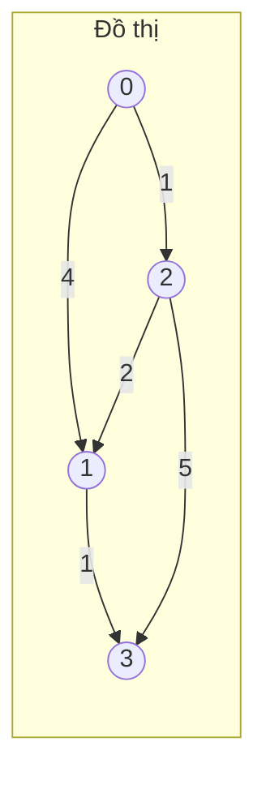
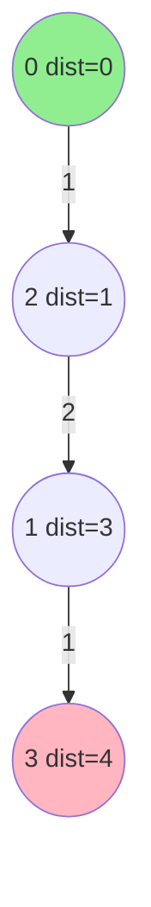

# 3. Thuật toán Dijkstra (Đường đi ngắn nhất)

## 3.1. Tổng quan

**Dijkstra** tìm đường đi ngắn nhất từ một **đỉnh nguồn** đến mọi đỉnh còn lại trên **đồ thị có trọng số không âm** (cạnh ≥ 0).

**Ứng dụng thực tế:** **Google Maps / Waze** — đường đi ngắn nhất theo thời gian hoặc km; định tuyến trong mạng (router chọn đường ít trễ nhất); tối ưu lộ trình giao hàng.

| Thuộc tính | Giá trị |
|------------|--------|
| **Độ phức tạp (danh sách kề + heap)** | O((V + E) log V) |
| **Độ phức tạp (ma trận kề)** | O(V²) |
| **Điều kiện** | Trọng số cạnh không âm |
| **Loại** | Tham lam (Greedy) |

---

## 3.2. Ý tưởng

1. Khởi tạo khoảng cách từ nguồn đến chính nó = 0, đến các đỉnh khác = +∞.
2. Dùng **hàng đợi ưu tiên (min-heap)** lưu các cặp (khoảng cách, đỉnh).
3. Lấy đỉnh `u` có khoảng cách nhỏ nhất; với mỗi cạnh `(u, v)` có trọng số `w`, nếu `dist[u] + w < dist[v]` thì cập nhật `dist[v]` và đưa `(dist[v], v)` vào heap.
4. Lặp đến khi heap rỗng (hoặc đã xử lý đủ đỉnh).

### Hình minh họa: Đồ thị và đường đi ngắn nhất

Đồ thị ví dụ (nguồn = 0). Số trên cạnh là trọng số. Sau Dijkstra: dist = [0, 3, 1, 4].



**Cây đường đi ngắn nhất** từ 0 (cạnh nét đậm = nằm trên đường ngắn nhất):



**Thứ tự Dijkstra (min-heap):** lấy 0 → cập nhật 1,2 → lấy 2 → cập nhật 1,3 → lấy 1 → cập nhật 3 → lấy 3.

---

## 3.3. Mã giả (Pseudocode)

```
DIJKSTRA(graph, source):
    dist[source] = 0
    for each vertex v != source:
        dist[v] = INFINITY
    PQ = MinPriorityQueue()
    PQ.insert((0, source))
    while PQ is not empty:
        (d, u) = PQ.extractMin()
        if d > dist[u]: continue   // bản cũ, bỏ qua
        for each neighbor v of u with weight w:
            if dist[u] + w < dist[v]:
                dist[v] = dist[u] + w
                PQ.insert((dist[v], v))
    return dist
```

---

## 3.4. Ví dụ minh họa

Đồ thị 4 đỉnh (0, 1, 2, 3), nguồn = 0:

- 0 → 1: trọng số 4  
- 0 → 2: trọng số 1  
- 2 → 1: trọng số 2  
- 2 → 3: trọng số 5  
- 1 → 3: trọng số 1  

**Các bước:**

| Bước | Đỉnh lấy ra | dist[] sau bước |
|------|-------------|------------------|
| 0 | - | [0, ∞, ∞, ∞] |
| 1 | 0 | [0, 4, 1, ∞] |
| 2 | 2 | [0, 3, 1, 6] |
| 3 | 1 | [0, 3, 1, 4] |
| 4 | 3 | [0, 3, 1, 4] |

Kết quả: dist = [0, 3, 1, 4]. Đường ngắn nhất từ 0 đến 3: 0 → 2 → 1 → 3 = 1 + 2 + 1 = 4.

---

## 3.5. Code mẫu

### Python (dùng `heapq`)

```python
import heapq

def dijkstra(graph, source):
    """
    graph: dict hoặc list of list of (neighbor, weight)
    Ví dụ: graph[u] = [(v, w), ...]
    """
    n = len(graph)
    dist = [float('inf')] * n
    dist[source] = 0
    pq = [(0, source)]
    while pq:
        d, u = heapq.heappop(pq)
        if d > dist[u]:
            continue
        for v, w in graph[u]:
            if dist[u] + w < dist[v]:
                dist[v] = dist[u] + w
                heapq.heappush(pq, (dist[v], v))
    return dist

# Ví dụ: đồ thị trong mục 3.4
graph = [
    [(1, 4), (2, 1)],      # 0
    [(3, 1)],               # 1
    [(1, 2), (3, 5)],       # 2
    []                      # 3
]
print(dijkstra(graph, 0))   # [0, 3, 1, 4]
```

### C++ (dùng `priority_queue`)

```cpp
#include <vector>
#include <queue>
using namespace std;
const int INF = 1e9;

vector<int> dijkstra(const vector<vector<pair<int,int>>>& graph, int source) {
    int n = graph.size();
    vector<int> dist(n, INF);
    dist[source] = 0;
    priority_queue<pair<int,int>, vector<pair<int,int>>, greater<pair<int,int>>> pq;
    pq.push({0, source});
    while (!pq.empty()) {
        auto [d, u] = pq.top();
        pq.pop();
        if (d > dist[u]) continue;
        for (auto [v, w] : graph[u]) {
            if (dist[u] + w < dist[v]) {
                dist[v] = dist[u] + w;
                pq.push({dist[v], v});
            }
        }
    }
    return dist;
}
```

---

## 3.6. Phân tích độ phức tạp

- Mỗi cạnh được xem xét tối đa một lần khi đỉnh nguồn của nó được lấy ra; mỗi lần push/pop heap O(log V).
- **Tổng**: O(E log V) với heap. Nếu dùng danh sách kề và heap: O((V + E) log V).
- Với ma trận kề và tìm min bằng vòng lặp: O(V²).

---

## 3.7. Lưu ý

- **Không** dùng khi có cạnh trọng số **âm** (dùng Bellman-Ford hoặc SPFA).
- Có thể in lại đường đi bằng cách lưu mảng `parent[v]` khi cập nhật `dist[v]`.

---

## 3.8. Tài liệu tham khảo

- [Dijkstra's algorithm - Wikipedia](https://en.wikipedia.org/wiki/Dijkstra%27s_algorithm)
- CLRS, Chương 24: Single-Source Shortest Paths
