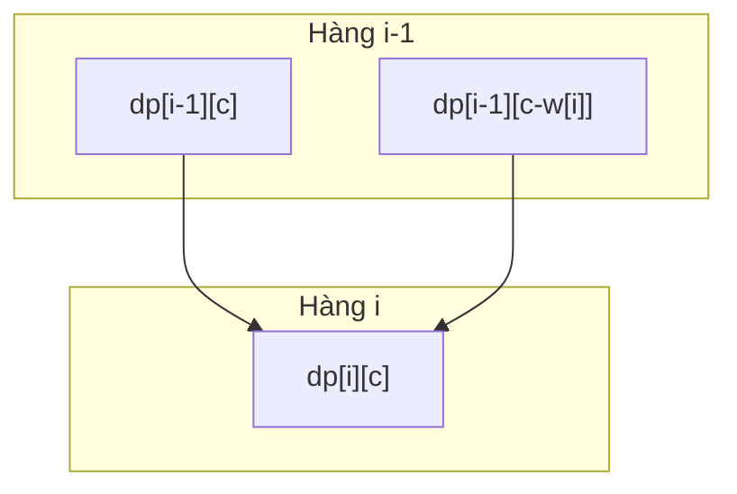
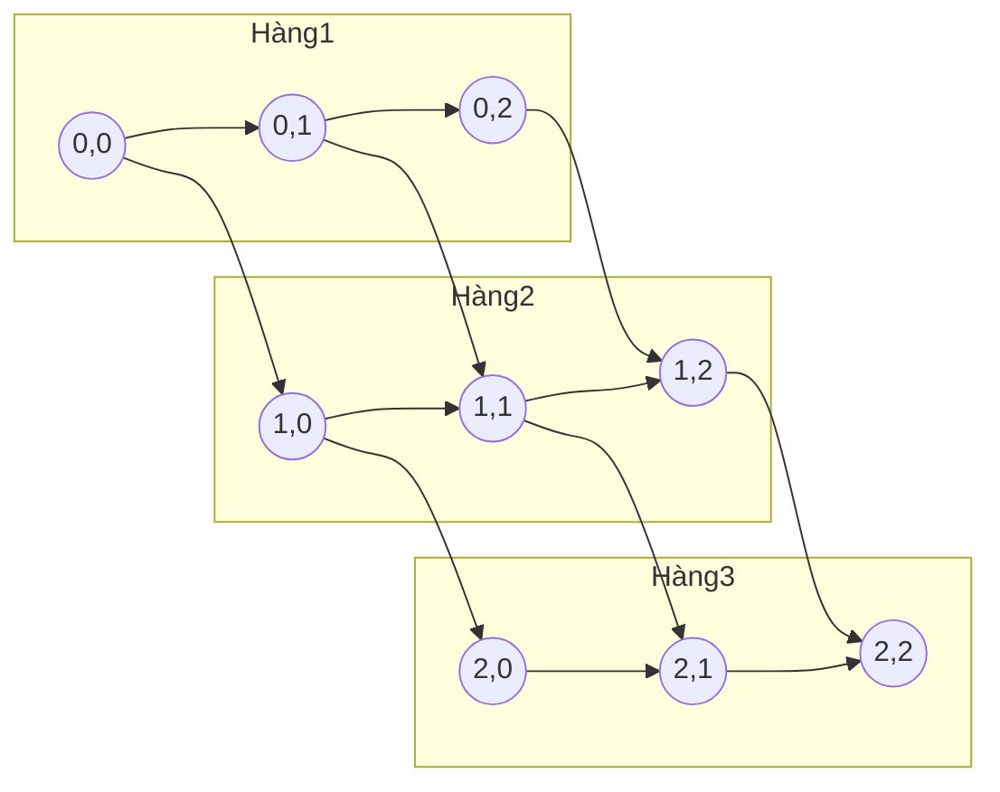

# 5. Quy hoạch động (Dynamic Programming - DP)

## 5.1. Tổng quan

**Quy hoạch động** là kỹ thuật giải bài toán bằng cách **chia nhỏ** thành các bài toán con, **lưu kết quả** (memoization hoặc bảng) để tránh tính lại, thường dùng khi bài toán có **cấu trúc con tối ưu** và **các bài toán con trùng lặp**.

| Thuộc tính | Mô tả |
|------------|--------|
| **Ý tưởng chính** | Lưu kết quả bài toán con để tái sử dụng |
| **Hai cách cài** | Memoization (đệ quy + nhớ) và Tabulation (bảng từ dưới lên) |
| **Điều kiện** | Cấu trúc con tối ưu + bài toán con trùng lặp |

---

## 5.2. Các bước thiết kế DP

1. **Định nghĩa trạng thái**: Ví dụ `dp[i]` = kết quả tối ưu cho bài toán con kích thước `i`.
2. **Công thức chuyển (recurrence)**: Biểu diễn `dp[i]` theo các `dp[j]` với `j < i` (hoặc theo trạng thái khác).
3. **Điều kiện cơ sở**: Giá trị khởi tạo (ví dụ `dp[0]`, `dp[1]`).
4. **Thứ tự tính**: Tính từ trạng thái nhỏ đến lớn (hoặc ngược lại) để khi tính `dp[i]` thì các `dp[j]` cần thiết đã có.

### Hình minh họa: Phụ thuộc trạng thái DP

**Fibonacci** — `dp[i]` chỉ phụ thuộc `dp[i-1]` và `dp[i-2]`:

```mermaid
flowchart LR
    dp0[dp[0]] --> dp2[dp[2]]
    dp1[dp[1]] --> dp2
    dp1 --> dp3[dp[3]]
    dp2 --> dp3
    dp2 --> dp4[dp[4]]
    dp3 --> dp4
```

**Knapsack** — `dp[i][c]` phụ thuộc `dp[i-1][c]` và `dp[i-1][c-w[i]]`:



**Min Path Sum** — lưới 3×3, mỗi ô phụ thuộc ô trên và ô trái:



---

## 5.3. Ví dụ 1: Dãy Fibonacci

**Bài toán**: F(0)=0, F(1)=1, F(n)=F(n-1)+F(n-2). Tính F(n).

### Công thức DP

- Trạng thái: `dp[i]` = F(i).
- Cơ sở: `dp[0]=0`, `dp[1]=1`.
- Chuyển: `dp[i] = dp[i-1] + dp[i-2]`.

### Code (Tabulation – O(n) thời gian, O(n) không gian)

```python
def fibonacci(n):
    if n <= 1:
        return n
    dp = [0] * (n + 1)
    dp[0], dp[1] = 0, 1
    for i in range(2, n + 1):
        dp[i] = dp[i - 1] + dp[i - 2]
    return dp[n]
```

### Code (Tối ưu không gian – O(1))

```python
def fibonacci_optimized(n):
    if n <= 1:
        return n
    prev, curr = 0, 1
    for _ in range(2, n + 1):
        prev, curr = curr, prev + curr
    return curr
```

---

## 5.4. Ví dụ 2: Bài toán cái túi 0-1 (Knapsack)

**Bài toán**: Có n đồ vật, đồ vật thứ i có trọng lượng `w[i]` và giá trị `v[i]`. Túi chịu tối đa trọng lượng W. Chọn đồ vật để tổng giá trị lớn nhất (mỗi đồ vật dùng tối đa 1 lần).

### Trạng thái và công thức

- `dp[i][c]` = giá trị lớn nhất khi xét i đồ vật đầu và dung lượng còn lại c.
- Cơ sở: `dp[0][c] = 0` với mọi c.
- Chuyển:
  - Không lấy đồ i: `dp[i][c] = dp[i-1][c]`.
  - Lấy đồ i (nếu `w[i] <= c`): `dp[i][c] = max(dp[i][c], v[i] + dp[i-1][c - w[i]])`.

Có thể dùng mảng 1 chiều (tính từ c cao xuống thấp) để tiết kiệm bộ nhớ.

### Code (bảng 2 chiều)

```python
def knapsack_01(weights, values, W):
    n = len(weights)
    dp = [[0] * (W + 1) for _ in range(n + 1)]
    for i in range(1, n + 1):
        for c in range(W + 1):
            dp[i][c] = dp[i - 1][c]
            if weights[i - 1] <= c:
                dp[i][c] = max(dp[i][c], values[i - 1] + dp[i - 1][c - weights[i - 1]])
    return dp[n][W]

# Ví dụ: weights=[2,3,4], values=[3,4,5], W=5 → 7 (đồ 0 và 1)
print(knapsack_01([2, 3, 4], [3, 4, 5], 5))  # 7
```

---

## 5.5. Ví dụ 3: Đường đi ngắn nhất trong lưới (Min Path Sum)

**Bài toán**: Lưới m×n, mỗi ô có chi phí. Tìm tổng chi phí nhỏ nhất khi đi từ (0,0) đến (m-1, n-1), chỉ được đi xuống hoặc sang phải.

### Công thức

- `dp[i][j]` = chi phí nhỏ nhất đến ô (i, j).
- Cơ sở: `dp[0][0] = grid[0][0]`; cột 0 và hàng 0 cộng dồn.
- Chuyển: `dp[i][j] = grid[i][j] + min(dp[i-1][j], dp[i][j-1])`.

```python
def min_path_sum(grid):
    m, n = len(grid), len(grid[0])
    dp = [[0] * n for _ in range(m)]
    dp[0][0] = grid[0][0]
    for j in range(1, n):
        dp[0][j] = dp[0][j - 1] + grid[0][j]
    for i in range(1, m):
        dp[i][0] = dp[i - 1][0] + grid[i][0]
    for i in range(1, m):
        for j in range(1, n):
            dp[i][j] = grid[i][j] + min(dp[i - 1][j], dp[i][j - 1])
    return dp[m - 1][n - 1]
```

---

## 5.6. Memoization vs Tabulation

| Memoization | Tabulation |
|-------------|------------|
| Đệ quy + lưu kết quả vào bảng/cache | Vòng lặp, điền bảng từ cơ sở |
| Chỉ tính những trạng thái cần thiết | Thường tính toàn bộ trạng thái |
| Dễ viết từ công thức đệ quy | Tránh tràn stack, dễ tối ưu không gian |

---

## 5.7. Một số bài DP kinh điển

- **Longest Common Subsequence (LCS)**
- **Longest Increasing Subsequence (LIS)**
- **Edit Distance (Levenshtein)**
- **Coin change** (số cách đổi tiền / số xu ít nhất)
- **Subset sum**

---

## 5.8. Tài liệu tham khảo

- [Dynamic programming - Wikipedia](https://en.wikipedia.org/wiki/Dynamic_programming)
- CLRS, Chương 15: Dynamic Programming
