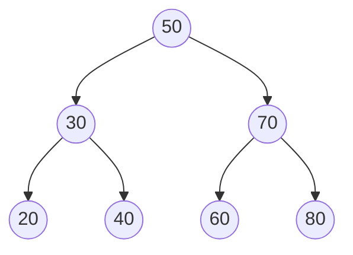
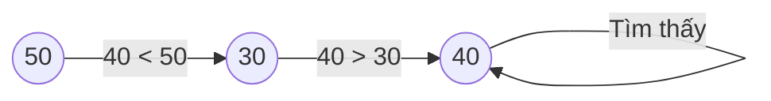

# 6. Cây nhị phân tìm kiếm (Binary Search Tree - BST)

## 6.1. Tổng quan

**Cây nhị phân tìm kiếm (BST)** là cây nhị phân mà với mỗi nút:

- Mọi khóa ở **cây con trái** đều **nhỏ hơn** khóa tại nút đó.
- Mọi khóa ở **cây con phải** đều **lớn hơn** khóa tại nút đó.

(Thường quy ước khóa trái ≤ nút < phải hoặc trái < nút ≤ phải tùy bài.)

| Thao tác | Độ phức tạp (TB) | Độ phức tạp (xấu nhất) |
|----------|-------------------|-------------------------|
| Tìm kiếm | O(log n) | O(n) |
| Chèn | O(log n) | O(n) |
| Xóa | O(log n) | O(n) |
| Duyệt (in-order) | O(n) | O(n) |

Xấu nhất xảy ra khi cây suy biến thành “dây” (linked list).

---

## 6.2. Cấu trúc dữ liệu nút

Mỗi nút gồm:

- `key`: khóa (giá trị so sánh).
- `left`: con trái.
- `right`: con phải.
- (Tùy chọn) `parent` cho một số thao tác.

### Hình minh họa: Cấu trúc BST và đường tìm kiếm

**BST với khóa 50, 30, 70, 20, 40, 60, 80** — mọi nút trái < gốc < phải:



**Đường tìm kiếm 40**: bắt đầu từ gốc, đi trái khi 40 < nút, đi phải khi 40 > nút.



**In-order** (trái → gốc → phải) cho dãy tăng dần: 20, 30, 40, 50, 60, 70, 80.

---

## 6.3. Các thao tác cơ bản

### 6.3.1. Tìm kiếm (Search)

- Bắt đầu từ gốc.
- Nếu `key == node.key` → tìm thấy.
- Nếu `key < node.key` → tìm bên trái.
- Nếu `key > node.key` → tìm bên phải.
- Nếu gặp `null` → không tìm thấy.

### 6.3.2. Chèn (Insert)

- Tìm vị trí lá phù hợp (giống Search); khi đi xuống null thì đó là vị trí chèn.
- Tạo nút mới và gắn vào con trái hoặc con phải của nút cha.

### 6.3.3. Xóa (Delete)

Ba trường hợp:

1. **Nút lá**: Xóa trực tiếp (gắn con của cha = null).
2. **Nút có một con**: Thay nút bị xóa bằng con duy nhất.
3. **Nút có hai con**: Tìm **nút thế mạng** (successor: nút nhỏ nhất ở cây con phải, hoặc predecessor: nút lớn nhất ở cây con trái). Copy khóa của nút thế mạng lên nút cần xóa, rồi xóa nút thế mạng (nút này chỉ có tối đa một con).

---

## 6.4. Duyệt cây (Traversal)

- **In-order** (trái – gốc – phải): cho dãy khóa **tăng dần**.
- **Pre-order** (gốc – trái – phải): thường dùng để sao chép/serialize.
- **Post-order** (trái – phải – gốc): thường dùng khi cần xử lý con trước gốc.

---

## 6.5. Ví dụ minh họa

BST với các khóa: 50, 30, 70, 20, 40, 60, 80.

```
        50
       /  \
      30   70
     / \   / \
    20 40 60 80
```

- **Search(40)**: 50 → 30 → 40 → tìm thấy.
- **In-order**: 20, 30, 40, 50, 60, 70, 80.

---

## 6.6. Code mẫu

### Python (lớp Node và BST)

```python
class Node:
    def __init__(self, key):
        self.key = key
        self.left = None
        self.right = None

class BST:
    def __init__(self):
        self.root = None

    def search(self, key):
        node = self.root
        while node and node.key != key:
            if key < node.key:
                node = node.left
            else:
                node = node.right
        return node

    def insert(self, key):
        new = Node(key)
        if not self.root:
            self.root = new
            return
        parent = None
        curr = self.root
        while curr:
            parent = curr
            curr = curr.left if key < curr.key else curr.right
        if key < parent.key:
            parent.left = new
        else:
            parent.right = new

    def _min_node(self, node):
        while node and node.left:
            node = node.left
        return node

    def delete(self, key):
        self.root = self._delete_rec(self.root, key)

    def _delete_rec(self, node, key):
        if not node:
            return None
        if key < node.key:
            node.left = self._delete_rec(node.left, key)
        elif key > node.key:
            node.right = self._delete_rec(node.right, key)
        else:
            if not node.left:
                return node.right
            if not node.right:
                return node.left
            succ = self._min_node(node.right)
            node.key = succ.key
            node.right = self._delete_rec(node.right, succ.key)
        return node

    def inorder(self, node=None):
        if node is None:
            node = self.root
        if not node:
            return []
        result = []
        result.extend(self.inorder(node.left))
        result.append(node.key)
        result.extend(self.inorder(node.right))
        return result

# Ví dụ
tree = BST()
for k in [50, 30, 70, 20, 40, 60, 80]:
    tree.insert(k)
print(tree.inorder())           # [20, 30, 40, 50, 60, 70, 80]
print(tree.search(40) is not None)  # True
tree.delete(20)
print(tree.inorder())           # [30, 40, 50, 60, 70, 80]
```

### C++ (cấu trúc cơ bản)

```cpp
struct Node {
    int key;
    Node* left = nullptr;
    Node* right = nullptr;
    Node(int k) : key(k) {}
};

Node* search(Node* root, int key) {
    while (root && root->key != key) {
        root = key < root->key ? root->left : root->right;
    }
    return root;
}

Node* insert(Node* root, int key) {
    if (!root) return new Node(key);
    if (key < root->key) root->left = insert(root->left, key);
    else root->right = insert(root->right, key);
    return root;
}
```

---

## 6.7. Cân bằng cây (AVL, Red-Black)

BST thông thường có thể suy biến thành O(n) cho mỗi thao tác. **Cây cân bằng** (AVL, Red-Black Tree) giữ chiều cao O(log n) sau mỗi chèn/xóa, nên mọi thao tác đều O(log n) trong trường hợp xấu nhất.

---

## 6.8. Tài liệu tham khảo

- [Binary search tree - Wikipedia](https://en.wikipedia.org/wiki/Binary_search_tree)
- CLRS, Chương 12: Binary Search Trees
