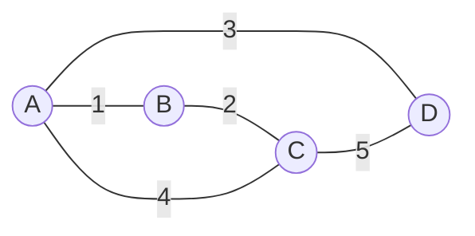
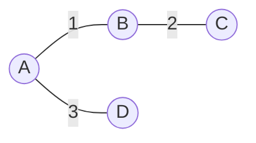

# 9. Cây bao trùm nhỏ nhất (Minimum Spanning Tree - MST)

## 9.1. Tổng quan

**Cây bao trùm nhỏ nhất (MST)** của đồ thị vô hướng có trọng số là một cây con **nối mọi đỉnh** với **tổng trọng số cạnh nhỏ nhất**. Hai thuật toán phổ biến: **Kruskal** (sắp xếp cạnh + DSU) và **Prim** (giống Dijkstra, chọn đỉnh gần nhất).

### Hình minh họa: Đồ thị và MST

**Đồ thị có trọng số** (số trên cạnh = trọng số):



**MST** (cây bao trùm tổng trọng số nhỏ nhất): chọn cạnh 1, 2, 3 → tổng = 6.



**Kruskal**: sắp cạnh (1, 2, 3, 4, 5), thêm (A-B), (B-C), (A-D); (A-C) và (C-D) bị bỏ vì tạo chu trình.

| Thuật toán | Thời gian | Không gian | Cách tiếp cận |
|------------|-----------|------------|----------------|
| Kruskal | O(E log E) | O(V) | Sắp xếp cạnh, thêm cạnh không tạo chu trình |
| Prim (heap) | O(E log V) | O(V) | Mở rộng cây từ một đỉnh, chọn cạnh nhỏ nhất |

---

## 9.2. Kruskal

### Ý tưởng

- Sắp xếp tất cả cạnh theo trọng số tăng dần.
- Lần lượt thêm cạnh vào MST nếu **không tạo chu trình** (dùng **Disjoint Set Union** để kiểm tra hai đỉnh đã cùng thành phần liên thông chưa).
- Dừng khi đã thêm đủ (V - 1) cạnh.

### Mã giả Kruskal

```
KRUSKAL(graph):
    sort edges by weight
    MST = empty
    DSU with each vertex as separate set
    for each edge (u, v, w) in sorted order:
        if FIND(u) != FIND(v):
            UNION(u, v)
            add (u, v, w) to MST
    return MST
```

### Code Kruskal (Python)

```python
def kruskal(n, edges):
    """edges: list of (u, v, w). Trả về tổng trọng số MST và danh sách cạnh."""
    parent = list(range(n))
    def find(x):
        if parent[x] != x:
            parent[x] = find(parent[x])
        return parent[x]
    def union(a, b):
        a, b = find(a), find(b)
        if a != b:
            parent[b] = a
    edges.sort(key=lambda e: e[2])
    mst_edges = []
    total = 0
    for u, v, w in edges:
        if find(u) != find(v):
            union(u, v)
            mst_edges.append((u, v, w))
            total += w
    return total, mst_edges
```

---

## 9.3. Prim

### Ý tưởng

- Bắt đầu từ một đỉnh bất kỳ (ví dụ 0), đưa vào tập MST.
- Mỗi bước chọn **cạnh có trọng số nhỏ nhất** nối từ tập MST ra ngoài; thêm đỉnh mới vào MST.
- Lặp đến khi có đủ V đỉnh (tức V-1 cạnh). Dùng **min-heap** để lấy cạnh nhỏ nhất nhanh.

### Mã giả Prim

```
PRIM(graph, start):
    in_MST = {start}
    PQ = min-heap of (weight, u, v) where u in MST, v not in MST
    add all edges from start to PQ
    while |in_MST| < V:
        (w, u, v) = PQ.extractMin()
        if v not in MST:
            add v to MST, add edge (u,v) to MST
            for each neighbor x of v: add (weight(v,x), v, x) to PQ
    return MST
```

### Code Prim (Python với heap)

```python
import heapq

def prim(n, adj):
    """
    adj: adj[u] = [(v, w), ...]
    Trả về tổng trọng số MST.
    """
    visited = [False] * n
    pq = [(0, 0, -1)]  # (w, v, parent)
    total = 0
    count = 0
    while pq and count < n:
        w, u, _ = heapq.heappop(pq)
        if visited[u]:
            continue
        visited[u] = True
        total += w
        count += 1
        for v, w2 in adj[u]:
            if not visited[v]:
                heapq.heappush(pq, (w2, v, u))
    return total if count == n else None
```

---

## 9.4. Ví dụ minh họa

Đồ thị 4 đỉnh: 0-1(1), 0-2(4), 1-2(2), 1-3(5), 2-3(3). MST: 0-1(1), 1-2(2), 2-3(3) → tổng = 6.

- **Kruskal**: Sắp xếp cạnh (1,2,3,4,5) → chọn (0,1), (1,2), (2,3).
- **Prim từ 0**: Thêm 0; cạnh nhỏ nhất ra ngoài (0,1); thêm 1; cạnh nhỏ nhất (1,2); thêm 2; cạnh nhỏ nhất (2,3) → xong.

---

## 9.5. So sánh Kruskal và Prim

| Tiêu chí | Kruskal | Prim |
|----------|---------|------|
| Cấu trúc dữ liệu | Sort + DSU | Heap (hoặc mảng) |
| Đồ thị thưa (E ≈ V) | Tốt | Tốt |
| Đồ thị dày (E ≈ V²) | O(E log E) | O(E log V) với heap |
| Cài đặt | Đơn giản | Cần quản lý heap/cạnh ra |

---

## 9.6. Tài liệu tham khảo

- [Kruskal's algorithm - Wikipedia](https://en.wikipedia.org/wiki/Kruskal%27s_algorithm)
- [Prim's algorithm - Wikipedia](https://en.wikipedia.org/wiki/Prim%27s_algorithm)
- CLRS, Chương 23: Minimum Spanning Trees
