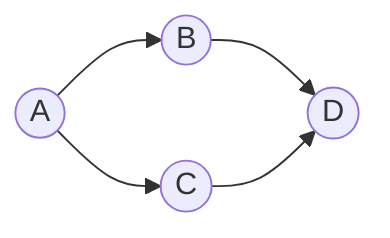

# 10. Sắp xếp tô-pô (Topological Sort)

## 10.1. Tổng quan

**Sắp xếp tô-pô (Topological Sort)** là một thứ tự tuyến tính của các đỉnh trong **đồ thị có hướng không chu trình (DAG)** sao cho với mọi cạnh (u → v), đỉnh u đứng **trước** v trong thứ tự đó. Ứng dụng: lập lịch công việc, biên dịch (phụ thuộc), thứ tự thực thi.

### Hình minh họa: DAG và thứ tự tô-pô

**Đồ thị DAG** (cạnh u → v nghĩa là "u phải trước v"):



**Một thứ tự tô-pô**: A, B, C, D (hoặc A, C, B, D). **Kahn**: A bậc vào 0 → xử lý A; sau đó B, C; cuối D.

| Thuộc tính | Giá trị |
|------------|--------|
| **Điều kiện** | Đồ thị phải là DAG (không có chu trình) |
| **Thời gian** | O(V + E) |
| **Không gian** | O(V) |
| **Kết quả** | Không duy nhất (có thể nhiều thứ tự hợp lệ) |

---

## 10.2. Hai cách cài đặt

### Cách 1: DFS – thứ tự kết thúc (post-order)

- Duyệt DFS; khi **kết thúc** thăm xong một đỉnh u (backtrack), đẩy u vào đầu danh sách (hoặc stack).
- Đảo ngược danh sách (hoặc pop stack) → thứ tự tô-pô.
- **Giải thích**: Đỉnh được “kết thúc” sau cùng sẽ không có cạnh đi ra đến đỉnh chưa xử lý → đặt cuối thứ tự; đỉnh kết thúc trước đặt trước.

### Cách 2: Kahn (BFS – bậc vào)

- Tính **bậc vào** (in-degree) của mỗi đỉnh.
- Đưa tất cả đỉnh có bậc vào = 0 vào hàng đợi.
- Lấy đỉnh u ra, đưa u vào thứ tự tô-pô; với mỗi cạnh (u → v), giảm bậc vào của v; nếu bậc vào v = 0 thì đưa v vào queue.
- Nếu số đỉnh trong thứ tự < V → đồ thị có **chu trình** (không có thứ tự tô-pô).

---

## 10.3. Mã giả

### DFS (Post-order)

```
TOPOLOGICAL_SORT_DFS(graph):
    visited = set()
    stack = []
    for each vertex u:
        if u not visited:
            DFS(u, graph, visited, stack)
    return reverse(stack)

DFS(u, graph, visited, stack):
    visited.add(u)
    for each neighbor v of u:
        if v not visited:
            DFS(v, graph, visited, stack)
    stack.push(u)
```

### Kahn (BFS)

```
TOPOLOGICAL_SORT_KAHN(graph):
    in_degree = compute in-degrees for all vertices
    queue = all vertices v with in_degree[v] == 0
    order = []
    while queue not empty:
        u = queue.dequeue()
        order.append(u)
        for each edge (u, v):
            in_degree[v]--
            if in_degree[v] == 0:
                queue.enqueue(v)
    if len(order) != V: return None  # cycle
    return order
```

---

## 10.4. Ví dụ minh họa

DAG: 5 → 0, 5 → 2, 4 → 0, 4 → 1, 2 → 3, 3 → 1.

- **Bậc vào**: 0:2, 1:2, 2:1, 3:1, 4:0, 5:0.
- **Kahn**: Bắt đầu với 4, 5. Một thứ tự có thể: 4, 5, 0, 2, 3, 1 (hoặc 5, 4, 2, 3, 0, 1 ...).

---

## 10.5. Code mẫu

### Python – Kahn

```python
from collections import deque

def topological_sort_kahn(n, edges):
    """
    n: số đỉnh (0..n-1)
    edges: list of (u, v) nghĩa là u -> v
    """
    adj = [[] for _ in range(n)]
    indeg = [0] * n
    for u, v in edges:
        adj[u].append(v)
        indeg[v] += 1
    q = deque(i for i in range(n) if indeg[i] == 0)
    order = []
    while q:
        u = q.popleft()
        order.append(u)
        for v in adj[u]:
            indeg[v] -= 1
            if indeg[v] == 0:
                q.append(v)
    return order if len(order) == n else None  # None nếu có chu trình
```

### Python – DFS

```python
def topological_sort_dfs(n, edges):
    adj = [[] for _ in range(n)]
    for u, v in edges:
        adj[u].append(v)
    visited = [False] * n
    stack = []
    def dfs(u):
        visited[u] = True
        for v in adj[u]:
            if not visited[v]:
                dfs(v)
        stack.append(u)
    for i in range(n):
        if not visited[i]:
            dfs(i)
    return stack[::-1]
```

---

## 10.6. Ứng dụng

- Xác định thứ tự biên dịch các module (phụ thuộc).
- Lập lịch công việc (task dependencies).
- Kiểm tra DAG và in chu trình nếu có (Kahn trả về None).

---

## 10.7. Tài liệu tham khảo

- [Topological sorting - Wikipedia](https://en.wikipedia.org/wiki/Topological_sorting)
- CLRS, Chương 22: Elementary Graph Algorithms
