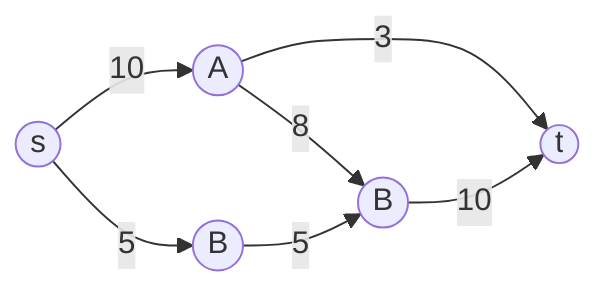

# 12. Luồng cực đại (Maximum Flow)

## 12.1. Tổng quan

**Bài toán luồng cực đại**: Cho mạng (đồ thị có hướng) với **khả năng thông qua** (capacity) trên mỗi cạnh, một **nguồn (source)** và một **đích (sink)**. Tìm **luồng** (flow) lớn nhất có thể từ nguồn đến đích, sao cho trên mỗi cạnh luồng không vượt quá khả năng thông qua và **bảo toàn** tại mỗi đỉnh trung gian (tổng luồng vào = tổng luồng ra).

**Ứng dụng thực tế:** Băng thông mạng (tối đa hóa lưu lượng); vận chuyển hàng (đường sắt, đường ống); ghép cặp (bipartite matching); cắt nhỏ nhất (min-cut) trong phân tách ảnh.

| Thuật toán | Thời gian | Ghi chú |
|------------|-----------|--------|
| Ford-Fulkerson (DFS) | O(E × |f*|) | |f*| = giá trị luồng cực đại |
| Edmonds-Karp (BFS) | O(V × E²) | Ford-Fulkerson với đường tăng luồng ngắn nhất |
| Dinic | O(V² × E) | Phân tầng + chặn luồng |

---

## 12.2. Định nghĩa và ý tưởng

- **Luồng**: Hàm f(u,v) trên cạnh thỏa: 0 ≤ f(u,v) ≤ c(u,v); và với mọi u (trừ s, t): tổng f(v,u) = tổng f(u,v).
- **Đường tăng luồng (augmenting path)**: Đường từ s đến t trên **đồ thị thặng dư** (residual graph), trong đó cạnh (u,v) có capacity còn lại = c(u,v) - f(u,v), cạnh ngược (v,u) có capacity = f(u,v).
- **Ford-Fulkerson**: Lặp lại: tìm một đường tăng luồng trên đồ thị thặng dư, tăng luồng dọc đường đó một lượng tối đa có thể; khi không còn đường tăng luồng thì luồng hiện tại là cực đại.

### Hình minh họa: Mạng và luồng

**Mạng** (s = nguồn, t = đích; số trên cạnh = capacity):



**Đường tăng luồng**: s → A → t (bottleneck 3) hoặc s → B → C → t. Sau nhiều bước tăng, tổng luồng = giá trị min-cut (ví dụ cắt {s} vs phần còn lại).

---

## 12.3. Định lý Min-Cut Max-Flow

Giá trị **luồng cực đại** từ s đến t bằng **khả năng thông qua của lát cắt nhỏ nhất** (min-cut) tách s và t (tổng capacity các cạnh từ tập chứa s sang tập chứa t).

---

## 12.4. Mã giả (Ford-Fulkerson với BFS = Edmonds-Karp)

```
EDMONDS_KARP(capacity, source, sink):
    flow = 0
    residual = copy of capacity
    while True:
        path, min_cap = BFS_find_path(residual, source, sink)
        if path is None: break
        flow += min_cap
        for each edge (u,v) in path:
            residual[u][v] -= min_cap
            residual[v][u] += min_cap
    return flow
```

---

## 12.5. Code mẫu (Edmonds-Karp – Python)

```python
from collections import deque

def edmonds_karp(n, capacity, source, sink):
    """
    n: số đỉnh
    capacity: ma trận n×n, capacity[u][v] = khả năng thông qua (u->v)
    """
    residual = [row[:] for row in capacity]
    flow = 0
    def bfs():
        parent = [-1] * n
        q = deque([source])
        parent[source] = source
        while q:
            u = q.popleft()
            if u == sink:
                break
            for v in range(n):
                if parent[v] == -1 and residual[u][v] > 0:
                    parent[v] = u
                    q.append(v)
        if parent[sink] == -1:
            return 0, None
        path = []
        v = sink
        min_cap = float('inf')
        while v != source:
            u = parent[v]
            path.append((u, v))
            min_cap = min(min_cap, residual[u][v])
            v = u
        return min_cap, path
    while True:
        min_cap, path = bfs()
        if path is None or min_cap == 0:
            break
        flow += min_cap
        for u, v in path:
            residual[u][v] -= min_cap
            residual[v][u] += min_cap
    return flow

# Ví dụ: 4 đỉnh 0->1(20), 0->2(10), 1->2(5), 1->3(10), 2->3(20)
n = 4
cap = [[0]*n for _ in range(n)]
cap[0][1], cap[0][2] = 20, 10
cap[1][2], cap[1][3] = 5, 10
cap[2][3] = 20
print(edmonds_karp(n, cap, 0, 3))  # 25
```

---

## 12.6. Ứng dụng

- Ghép cặp (bipartite matching) qua mạng: nguồn → bên trái → bên phải → đích.
- Bài toán chia công việc, ràng buộc.
- Cắt lát đồ thị (min-cut) sau khi có max-flow.

---

## 12.7. Tài liệu tham khảo

- [Maximum flow problem - Wikipedia](https://en.wikipedia.org/wiki/Maximum_flow_problem)
- [Ford–Fulkerson algorithm](https://en.wikipedia.org/wiki/Ford%E2%80%93Fulkerson_algorithm)
- [Edmonds–Karp algorithm](https://en.wikipedia.org/wiki/Edmonds%E2%80%93Karp_algorithm)
- CLRS, Chương 26: Maximum Flow
