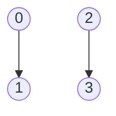
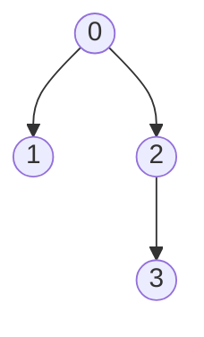

# 15. Disjoint Set Union (DSU / Union-Find)

## 15.1. Tổng quan

**Disjoint Set Union (DSU)** hay **Union-Find** là cấu trúc dữ liệu quản lý một phân hoạch của tập hợp: **hợp nhất** hai tập (Union) và **kiểm tra** hai phần tử có cùng tập hay không (Find). Dùng nhiều trong Kruskal, kiểm tra chu trình, thành phần liên thông.

**Ứng dụng thực tế:** Thuật toán Kruskal (MST); kiểm tra chu trình khi thêm cạnh; thành phần liên thông động; gom nhóm pixel (ảnh); game (cùng phe, kết nối).

| Thao tác | Gần O(1) với nén đường + gộp theo rank |
|----------|----------------------------------------|
| Find(x) | Trả về đại diện (root) của tập chứa x |
| Union(x, y) | Hợp nhất tập chứa x và tập chứa y |

Với **nén đường (path compression)** và **gộp theo rank**, thời gian gần như hằng số trên thực tế (inverse Ackermann).

---

## 15.2. Ý tưởng

- Mỗi tập có một **đại diện** (root). Mỗi phần tử trỏ đến cha; root trỏ đến chính nó (hoặc parent[root] = root).
- **Find(x)**: Đi từ x lên root. **Nén đường**: Sau khi tìm được root, gán tất cả nút trên đường từ x lên root trỏ thẳng đến root.
- **Union(x, y)**: Tìm root của x và root của y; gắn root của tập nhỏ hơn (theo rank hoặc size) làm con của root kia.

### Hình minh họa: Union-Find dạng cây

**Ban đầu**: mỗi phần tử là một tập (root trỏ chính nó).


**Sau Union(0,1), Union(2,3)** — hai cây:



**Sau Union(0,2)** — gắn root cây nhỏ hơn vào root cây kia:



**Find(3)**: 3 → 2 → 0 (root). Sau **nén đường**, 3 trỏ thẳng tới 0.

---

## 15.3. Mã giả

```
INIT(n):
    parent[i] = i for all i
    rank[i] = 0 (hoặc size[i] = 1)

FIND(x):
    if parent[x] != x:
        parent[x] = FIND(parent[x])   // nén đường
    return parent[x]

UNION(x, y):
    rx = FIND(x), ry = FIND(y)
    if rx == ry: return
    if rank[rx] < rank[ry]: swap(rx, ry)
    parent[ry] = rx
    if rank[rx] == rank[ry]: rank[rx]++
```

---

## 15.4. Ví dụ minh họa

Ban đầu: parent = [0,1,2,3,4], rank = [0,0,0,0,0].  
Union(0,1) → parent[1]=0; Union(2,3) → parent[3]=2; Union(0,2) → gắn root 2 vào root 0. Find(3) → 3→2→0, sau nén đường parent[3]=0.

---

## 15.5. Code mẫu

### Python

```python
class DSU:
    def __init__(self, n):
        self.parent = list(range(n))
        self.rank = [0] * n

    def find(self, x):
        if self.parent[x] != x:
            self.parent[x] = self.find(self.parent[x])
        return self.parent[x]

    def union(self, x, y):
        rx, ry = self.find(x), self.find(y)
        if rx == ry:
            return
        if self.rank[rx] < self.rank[ry]:
            rx, ry = ry, rx
        self.parent[ry] = rx
        if self.rank[rx] == self.rank[ry]:
            self.rank[rx] += 1

    def same(self, x, y):
        return self.find(x) == self.find(y)

# Ví dụ
dsu = DSU(5)
dsu.union(0, 1)
dsu.union(2, 3)
dsu.union(0, 2)
print(dsu.same(0, 3))   # True
print(dsu.find(3))      # 0 (sau nén đường)
```

### C++

```cpp
struct DSU {
    vector<int> parent, rank;
    DSU(int n) : parent(n), rank(n) {
        iota(parent.begin(), parent.end(), 0);
    }
    int find(int x) {
        return parent[x] == x ? x : parent[x] = find(parent[x]);
    }
    void unite(int x, int y) {
        x = find(x), y = find(y);
        if (x == y) return;
        if (rank[x] < rank[y]) swap(x, y);
        parent[y] = x;
        if (rank[x] == rank[y]) rank[x]++;
    }
};
```

---

## 15.6. Ứng dụng

- **Kruskal**: Kiểm tra cạnh (u, v) có tạo chu trình không bằng Find(u) == Find(v).
- Đếm thành phần liên thông sau các Union.
- Bài toán đồng bộ, nhóm bạn bè, v.v.

---

## 15.7. Tài liệu tham khảo

- [Disjoint-set data structure - Wikipedia](https://en.wikipedia.org/wiki/Disjoint-set_data_structure)
- CLRS, Chương 21: Data Structures for Disjoint Sets
