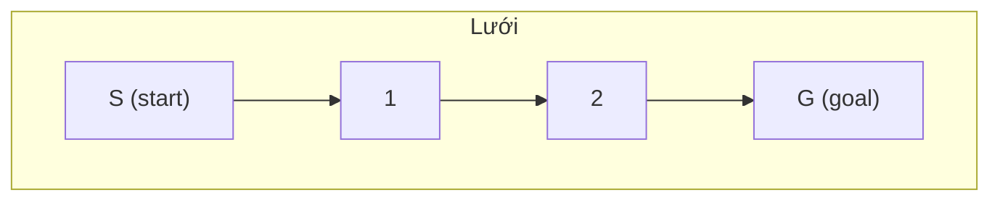

# 16. Thuật toán A* (A-Star)

## 16.1. Tổng quan

**A*** là thuật toán **tìm đường** từ điểm bắt đầu đến điểm đích trên đồ thị (thường là lưới hoặc graph có trọng số). A* dùng **hàm đánh giá** f(n) = g(n) + h(n): g(n) = chi phí từ start đến n, h(n) = heuristic ước lượng chi phí từ n đến goal. Thuật toán **tham lam** mở rộng đỉnh có f(n) nhỏ nhất, đảm bảo tối ưu nếu heuristic **chấp nhận được** (admissible) và **nhất quán** (consistent).

| Thuộc tính | Giá trị |
|------------|--------|
| **Thời gian** | Phụ thuộc heuristic; tốt nhất O(b^d) với b nhánh, d độ sâu |
| **Không gian** | O(b^d) cho open/closed set |
| **Tối ưu** | Có, khi h admissible (và consistent với cạnh không âm) |
| **Đầy đủ** | Có (nếu có đường đi) |

---

## 16.2. Heuristic

- **Chấp nhận được**: h(n) ≤ chi phí thực từ n đến goal (không ước lượng quá cao).
- **Nhất quán**: h(n) ≤ cost(n, n') + h(n') với mọi cạnh (n → n').  
Ví dụ trên lưới 4 hướng: **khoảng cách Manhattan**; trên lưới 8 hướng: **khoảng cách Chebyshev** hoặc **đường chéo**.

### Hình minh họa: A* trên lưới

**Lưới** (ô trắng = đi được, ô xám = vật cản). A* ưu tiên ô có f = g + h nhỏ nhất; h = Manhattan distance đến đích.



**So sánh**: Dijkstra mở rộng đều mọi hướng; A* nghiêng về phía goal nhờ h(n), nên ít ô mở rộng hơn (đặc biệt khi có ít vật cản).

---

## 16.3. Mã giả

```
A_STAR(start, goal):
    open_set = min-heap by f, insert (f(start), g(start), start)
    g_score[start] = 0
    while open_set not empty:
        (f, g, current) = open_set.pop()
        if current == goal: return reconstruct_path(parent, goal)
        if current in closed: continue
        closed.add(current)
        for each neighbor n of current with cost c:
            tentative = g + c
            if tentative < g_score[n]:
                g_score[n] = tentative
                f = tentative + h(n, goal)
                open_set.push((f, tentative, n))
                parent[n] = current
    return None  // không tìm thấy đường
```

---

## 16.4. So sánh với Dijkstra và BFS

- **Dijkstra**: Không dùng heuristic (h=0), mở rộng theo g(n). Luôn tối ưu.
- **BFS**: Đồ thị không trọng số, không heuristic.
- **A***: Dùng h(n) để ưu tiên hướng gần goal → ít đỉnh mở rộng hơn khi có đường đi tốt.

---

## 16.5. Code mẫu (Python – lưới 4 hướng)

```python
import heapq

def heuristic(a, b):
    return abs(a[0] - b[0]) + abs(a[1] - b[1])

def a_star(grid, start, goal):
    """
    grid: ma trận 0 (đi được) / 1 (vật cản)
    start, goal: (r, c)
    """
    n, m = len(grid), len(grid[0])
    dr = [-1, 1, 0, 0]
    dc = [0, 0, -1, 1]
    g_score = {start: 0}
    open_set = [(heuristic(start, goal), 0, start)]
    parent = {}
    while open_set:
        f, g, (r, c) = heapq.heappop(open_set)
        if (r, c) == goal:
            path = []
            cur = goal
            while cur in parent:
                path.append(cur)
                cur = parent[cur]
            path.append(start)
            return path[::-1]
        if g > g_score.get((r, c), float('inf')):
            continue
        for i in range(4):
            nr, nc = r + dr[i], c + dc[i]
            if 0 <= nr < n and 0 <= nc < m and grid[nr][nc] == 0:
                ng = g + 1
                if ng < g_score.get((nr, nc), float('inf')):
                    g_score[(nr, nc)] = ng
                    heapq.heappush(open_set, (ng + heuristic((nr, nc), goal), ng, (nr, nc)))
                    parent[(nr, nc)] = (r, c)
    return None
```

---

## 16.6. Ứng dụng

- Tìm đường trong game, robot, bản đồ.
- Giải puzzle (8-puzzle, 15-puzzle) với heuristic (ví dụ số ô sai vị trí).

---

## 16.7. Tài liệu tham khảo

- [A* search algorithm - Wikipedia](https://en.wikipedia.org/wiki/A*_search_algorithm)
- [Red Blob Games: Introduction to A*](https://www.redblobgames.com/pathfinding/a-star/introduction.html)
