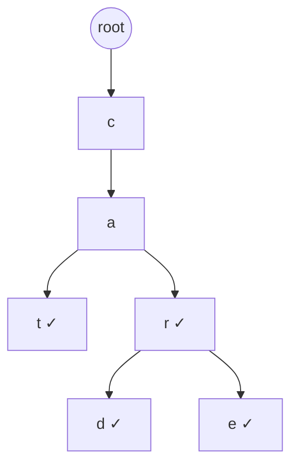

# 17. Trie (Cây tiền tố)

## 17.1. Tổng quan

**Trie** (cây tiền tố / prefix tree) là cấu trúc dữ liệu lưu tập chuỗi: mỗi cạnh tương ứng một ký tự, mỗi đường từ gốc đến nút đánh dấu **kết thúc** tương ứng một chuỗi trong tập. Dùng cho từ điển, autocomplete, tìm tiền tố chung.

| Thao tác | Thời gian | Ghi chú |
|----------|-----------|--------|
| Chèn chuỗi độ dài m | O(m) | |
| Tìm chuỗi độ dài m | O(m) | |
| Tìm tất cả chuỗi có tiền tố p | O(|p| + k) | k = số chuỗi có tiền tố p |
| Xóa | O(m) | |

---

## 17.2. Cấu trúc nút

- Mỗi nút có:
  - Con trỏ (hoặc mảng) tới các nút con theo ký tự (ví dụ `children[26]` cho 'a'–'z').
  - Cờ `is_end` (hoặc số lượng chuỗi kết thúc tại nút).

### Hình minh họa: Trie chứa "cat", "car", "card", "care"

Mỗi cạnh là một ký tự; nút có dấu ✓ là kết thúc từ.



**Tìm "car"**: root → c → a → r (✓) = có. **Tìm tiền tố "ca"**: root → c → a = có hai từ "cat", "car" (và "card", "care").

---

## 17.3. Mã giả

```
INSERT(root, s):
    node = root
    for each char c in s:
        if node.children[c] is null:
            node.children[c] = new Node()
        node = node.children[c]
    node.is_end = true

SEARCH(root, s):
    node = root
    for each char c in s:
        if node.children[c] is null: return false
        node = node.children[c]
    return node.is_end

STARTS_WITH(root, prefix):
    node = root
    for each char c in prefix:
        if node.children[c] is null: return false
        node = node.children[c]
    return true
```

---

## 17.4. Ví dụ minh họa

Chèn "cat", "car", "card", "care":

```
        root
       /    \
      c      ...
     /
    a
   / \
  t   r
  |   |
(end) (end)
      / \
     d   e
   (end)(end)
```

---

## 17.5. Code mẫu (Python)

```python
class TrieNode:
    def __init__(self):
        self.children = {}
        self.is_end = False

class Trie:
    def __init__(self):
        self.root = TrieNode()

    def insert(self, word):
        node = self.root
        for c in word:
            if c not in node.children:
                node.children[c] = TrieNode()
            node = node.children[c]
        node.is_end = True

    def search(self, word):
        node = self.root
        for c in word:
            if c not in node.children:
                return False
            node = node.children[c]
        return node.is_end

    def starts_with(self, prefix):
        node = self.root
        for c in prefix:
            if c not in node.children:
                return False
            node = node.children[c]
        return True

# Ví dụ
t = Trie()
t.insert("cat")
t.insert("car")
t.insert("card")
print(t.search("car"))        # True
print(t.search("ca"))         # False
print(t.starts_with("ca"))    # True
```

### C++ (trích đoạn)

```cpp
struct TrieNode {
    unordered_map<char, TrieNode*> children;
    bool is_end = false;
};
void insert(TrieNode* root, const string& s) {
    auto node = root;
    for (char c : s) {
        if (!node->children.count(c)) node->children[c] = new TrieNode();
        node = node->children[c];
    }
    node->is_end = true;
}
```

---

## 17.6. Biến thể

- **Compressed Trie (Radix Tree)**: Nén chuỗi cạnh để giảm số nút.
- **Suffix Trie**: Trie của tất cả hậu tố của một chuỗi (dùng trong tìm kiếm chuỗi).

---

## 17.7. Tài liệu tham khảo

- [Trie - Wikipedia](https://en.wikipedia.org/wiki/Trie)
- CLRS, Chương 12 (cấu trúc cây) và 32 (chuỗi)
